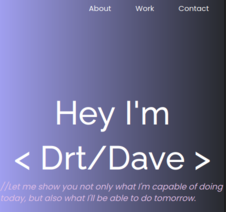

# My Portfolio

 

>    Click on the image to visit the site 👆 

## Installation

1. Clone this repository to your local computer
2. Open the index.html file in your web browser

## Usage

Simply click on the links to be redirected to the corresponding projects.
## Contributing

If you'd like to contribute to this project, please follow these steps:

1. Fork this repository
2. Create a branch with your changes: git checkout -b your-branch-name
3. Make the necessary changes and commit: git commit -m "Description of your changes"
4. Push your changes to your GitHub repository: git push origin your-branch-name
5. Create a pull request to this repository.

## License

This project is licensed under the MIT License. See the LICENSE file for more details.
Contact

> If you have any questions or comments about this project, please contact me via email: davidduartef@gmail.com 
